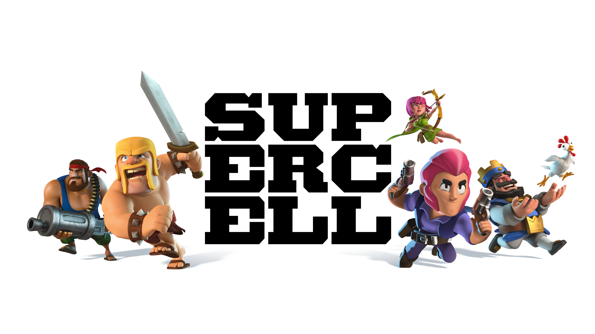
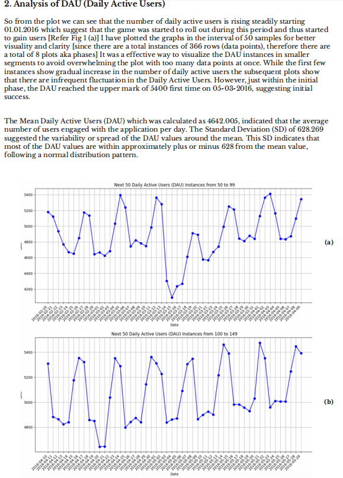
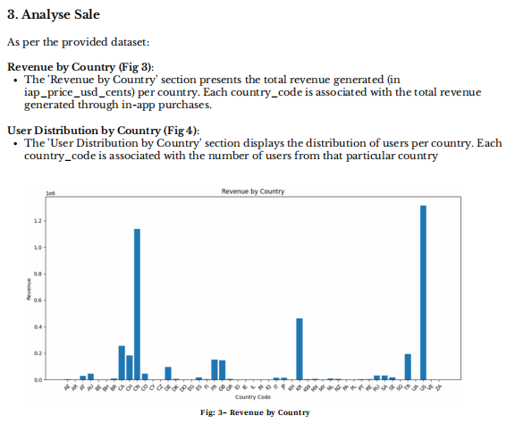

# Super Cell Interview Puzzle

    

This project was for **SuperCell** company and the for **Clash Royale**. Involved analyzing of game dataset with python. Great opportunity to learn new skills, game dataset niches and context.

## Task Eng

Sql dataset was provided in `.sqlite`.

It contains sample data from a hypothetical free-to-play mobile game. Your task is to use 
this data set to answer the questions below and prepare a report of your findings. The 
report should be written to an audience of game and business developers, and it will be 
reviewed on actionability, insightfulness and clarity.

## About data:

The database contains three tables: **account**, **account_date_session** and **iap_purchase**. 
**account** contains user profiles, **iap_purchase** contains in-app purchases by the users, and 
account_date_session contains the number of sessions for the users for the days they 
have been active. All the tables contain data for the year of 2016.

You can access the **SQLite3** database by command line interface **sqlite3**. There are also 
libraries for **R** and **python**. 

We’d prefer that you complete the assignment using **SQL**, **R**, and/or **python** but feel free to 
use any tools that you think are suitable for the job. The only criteria is still that the plots 
you do should be reproducible with the code you are writing. 

We will assess the visualisation based on clarity and readability, and your conclusions 
based on actionability and insightfulness.

## Questions:

1. Give us short description of datasets.
2. Analyse the daily active users: 
    - Compare DAU changes over time.
    - Can you identify any trends in data?
    - Can you find any ups or drops that are out of the normal behaviour?
    - What do you think why do they happen?
3. Analyse sales:
    - Analyse the geographic split of the revenue and the users.
    - Calculate average revenue per user per market.
    - What are your observations of the results?

## Task Fin

- Todo

## Some pics of report

- Full report is found [here](https://github.com/Rish-5k/Clash_Royale_Test/blob/main/Kesari.Rishikesh_TestReport.pdf).